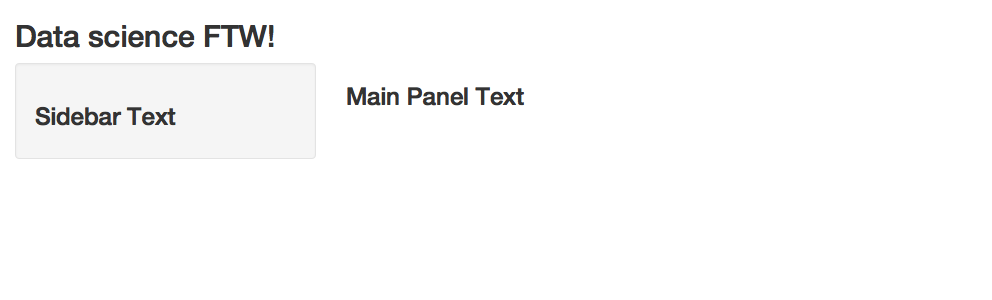
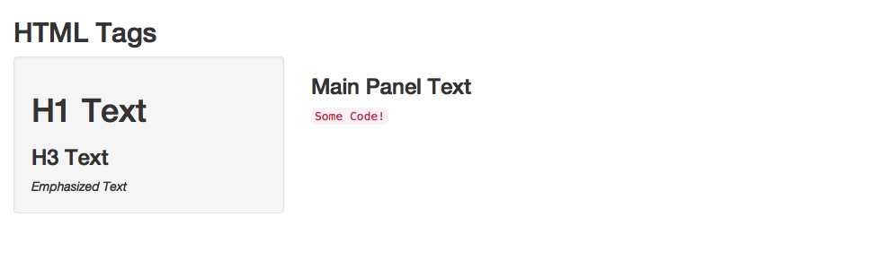

# Shiny

[Watch this video before beginning]()

Shiny is a modern programming miracle and it helps to make R one of the most
competitive languages for communicating insights from data. Shiny is developed
by RStudio and it is described as "A web application framework for R". Unlike
web application frameworks in many other languages the time it takes to write
a beautiful, functional, and mobile-ready Shiny application is truly minimal,
which makes it ideal for rapid prototyping and easy deployment.
The folks at RStudio have the following pitch:
"Turn your analyses into interactive web applications
No HTML, CSS, or JavaScript knowledge required". This statement is mostly
true, though a little HTML knowledge is useful for understanding
some of the concepts. If you're interested in learning more about HTML, CSS, 
and Javascript we recommend any one of the following resources:

- [Mozilla Developer Network Tutorials](https://developer.mozilla.org/en-US/docs/Web/Tutorials)
- [HTML & CSS from Khan Academy](https://www.khanacademy.org/computing/computer-programming/html-css)
- [Tutorials from Free Code Camp](https://www.freecodecamp.com/)

We'll proceed as if your HTML knowledge is very basic and no more advanced than
understanding heading levels or fonts.

## Installing Shiny

First, make sure you have the latest release of R installed.
If on Windows, make sure that you have [Rtools](https://cran.r-project.org/bin/windows/Rtools/) installed.
Then, you can install `shiny` with

```{r, eval=FALSE}
install.packages("shiny")
libray(shiny)
```

## Your First Shiny App

Let's build our first app. Like many projects in this book, we'll start with a
simple example app. First create a new directory where you can store all of the
files associated with your app. I like to organize my shiny app into two
separate files: `ui.R` which contains all of the user interface elements of the
app, and `server.R` which contains the logic of the app, including code for
loading and handling data. You can find the code for each of these files below:

**App 1: ui.R**

```{r, cache=FALSE, echo=FALSE}
knitr::read_chunk("assets/shinyapps/app1/ui.R")
```

```{r app1-ui, eval=FALSE}
```

**App 1: server.R**

```{r, cache=FALSE, echo=FALSE}
knitr::read_chunk("assets/shinyapps/app1/server.R")
```

```{r app1-server, eval=FALSE}
```

This app is extremely minimal, it's just meant to get you familair with the
syntax of shiny apps including the nested nature of the user interface elements.
Create these two files inside of your new directory, then change your current
working directory to that folder using `setwd()`. After loading shiny with
`library(shiny)` enter `runApp()` into the
R console to start the app. Alternatively you can provide the path to the
directory containing the `ui.R` and `server.R` files as an argument to
`runApp()`. You app should look something like this:

```{r, echo=FALSE}
check_app_image <- function(app, vheight){
  app_image <- file.path("assets", "images", paste0(app, ".png"))
  app_ui <- file.path("assets", "shinyapps", app, "ui.R")
  app_server <- file.path("assets", "shinyapps", app, "server.R")
  app_image_is_old <- !file.exists(app_image) || 
    file.mtime(app_ui) > file.mtime(app_image) ||
    file.mtime(app_server) > file.mtime(app_image)
  if(app_image_is_old){
    webshot::appshot(app = dirname(app_ui), file = app_image, vheight = vheight)
  }
  invisible()
}

check_app_image("app1", 300)
```



Let's walk through the code in `ui.R`. The `fluidPage()` function specifies a
type of user interface for Shiny to display. Fluid pages try to intelligently
rearrange themselves depending on the size of the screen that's displaying the
app which makes this layout look better on mobile devices. Instead of a 
`fluidPage()` you could use a `fixedPage()` which will not resize your app. The
`titlePanel()` function defines a title on the top of the page and the 
`sidebarLayout()` function defines the layout for everything below the title
panel. The `sidebarLayout()` splits the page into a sidebar and a main part of
the page, which are then specified with the `sidebarPanel()` function and the
`mainPanel()` function respectively. Inside the `sidebarPanel()` and the
`mainPanel()` I put an `h3()` heading, which just displays some text and is
the same as specifying an `<h3>` tag in HTML.

The `ui.R` simply defines the layout of the page. If you run the code in `ui.R`
on it's own you can see that a standard set of HTML tags are returned:

```{r, echo=FALSE, message=FALSE, comment=""}
ui <- source("assets/shinyapps/app1/ui.R")
cat(as.character(ui$value))
```

All Shiny is doing is piecing together some HTML! 

## More UI Elements

Let's take a look at another simple app with a slighly more complex UI:

**App 2: ui.R**

```{r, cache=FALSE, echo=FALSE}
knitr::read_chunk("assets/shinyapps/app2/ui.R")
```

```{r app2-ui, eval=FALSE}
```

**App 2: server.R**

```{r, cache=FALSE, echo=FALSE}
knitr::read_chunk("assets/shinyapps/app2/server.R")
```

```{r app2-server, eval=FALSE}
```

The code above will produce an app like this:

```{r, echo=FALSE}
check_app_image("app2", 300)
```



In this example we've added a few UI elements and you can see how they are
rendered in the app.

If you're like most R users when you first encounter shiny, you're probably
wondering "What is going on? Why is the syntaxt so strange?"
To get used to programming shiny apps, you need to throw away a little of your
thinking about R; it's a different style of programming.

Let's parse through what's going on with our two files to hopefully make things
more clear.  The `ui.R` function is controlling
the interface. The function `shinyUI` is alerting R to that. The interior
function, `fluidPage` is telling `shinyUI` what kind of page to create.
In this case, it's a page that can rearrange itself based on what you include
in the UI, and it can rearrange itself so the app is easy to use on mobile
screens.
You specify all elements of the page using functions. In this case we want
a title `titlePanel("Data science FTW!")`. Then we want the `sidebarPanel`
to contain certain elements. So, the `sidebarPanel` function then takes 
arguments (again functions) of its elements. The statement `h3('Sidebar text')`
is saying that we want the text `Siderbar text` in the sidebar (since this
function occurs within the function `sidebarPanel`) and we want it to be at
the font size `h3`. If you know a little html, you'll recognize `h3` as the
third heading level font size. Similar to the `sidebarPanel` function, the
`mainPanel` function takes functional arguments for the main panel. 

Probably the most frequent syntaxt error for shiny is not putting commas
in the right places of `ui.R`. Remember, the page elements are input as
arguments, so they need commas like all arguments to R functions.arguments

The `server.R` file is a little easier. The file `shinyServer` tells
R that it's dealing with a shiny server. The server function always
take an argument of a function with arguments `inputs` and `outputs`.
In this case, our function doesn't do anything.

## Style and markup 

Perhaps the easiest way to illustrate markup is through an example.
While keeping the `server.R` file the same, change the `ui.R` file 
to the following:

{lang=r,line-numbers=off}
~~~
shinyUI(pageWithSidebar(
  headerPanel("Illustrating markup"),
  sidebarPanel(
      h1('Sidebar panel'),
      h1('H1 text'),
      h2('H2 Text'),
      h3('H3 Text'),
      h4('H4 Text')

  ),
  mainPanel(
      h3('Main Panel text'),
      code('some code'),
      p('some ordinary text')
  )
))
~~~

This produces the output:


## Different input types

Shiny allows for many different input types. In the following example,
we change `ui.R` to allow for a few different input types. After you get the hang of these, 
any new ones will be easy. We leave
`server.R` as is, so our inputs don't do anything.  See below
the numeric input, checkbox, and date input. 

{lang=r,line-numbers=off}
~~~
shinyUI(pageWithSidebar(
  headerPanel("Illustrating inputs"),
  sidebarPanel(
    numericInput('id1', 'Numeric input, labeled id1', 0, min = 0, max = 10, step = 1),
    checkboxGroupInput("id2", "Checkbox",
                   c("Value 1" = "1",
                     "Value 2" = "2",
                     "Value 3" = "3")),
    dateInput("date", "Date:")  
  ),
  mainPanel(

  )
))
~~~

Run this to see the inputs. They're also shown in the next image 
a few paragraphs below.

Refer to [this lesson](http://shiny.rstudio.com/tutorial/lesson3/) on the
shiny tutorial site for a complete list of inputs available. Once you
get the hang of one or two of them, then the remainder will be easy.
So, do the above example first and then move on to trying some of the
others. 

Right now, nothing is done with our inputs. Let's see if we can figure output
how to  at least get them into `server.R`.

## Making your site interactive

Now that we have a bit of a handle on creating a shiny user
interface, let's make `server.R` reactive to the inputs from
`ui.R`.  First, let's adapt our previous 
simple `ui.R` file to illustrate. Take the last example, where
we collected a numeric input, checkbox and a date, and replace
the `mainPanel` function with below.

{lang=r,line-numbers=off}
~~~
mainPanel(
        h3('Illustrating outputs'),
        h4('You entered'),
        verbatimTextOutput("oid1"),
        h4('You entered'),
        verbatimTextOutput("oid2"),
        h4('You entered'),
        verbatimTextOutput("odate")
  )
~~~

Our goal is to have our sidebarPanel collect the inputs and
our main panel display them. The variables `oid1`, `oid2`
and `odate` are all outcome variables that we define in our
`server.R` function. Here it is:

{lang=r,line-numbers=off}
~~~
shinyServer(
  function(input, output) {
    output$oid1 = renderPrint({input$id1})
    output$oid2 = renderPrint({input$id2})
    output$odate = renderPrint({input$date})
  }
)
~~~

So, our function takes in `input$id1` and prints out `oid1`. 
Note that `id1` was the name given to our numeric input in our
`ui.R` function. This is storred in `input$id1`. The label
`id2` was given to our checkbox data in `ui.R` and it's value
is storred in `input$id2`. Similarly, `date` was the label
given to the input date and it is stored in `input$date`. 

It is important in `server.R` to break from how we think about
R programs being executed linearly. Instead, think of the 
functions being executed reactively to changing input from the
`ui.R` function. The `renderPrint` function take the reactive
input and assigns it to the output variable. Note the peculiar
syntax for `renderPrint` in the `({R Statements })`. 

In this case, our `server.R` function is merely taking our
inputed data and returning it right back. We named our output
variables `oid1`, `oid2` and `odate`, the same names used in
`ui.R`. The `renderPrint` statement says that it is being sent
back to `ui.R` for formatted display.

Here's an example of the running of the code:


## Putting it all together

Now let's build our prediction algorithm. 
For the `ui.R` files, let's try

{lang=r,line-numbers=off}
~~~
shinyUI(
  pageWithSidebar(
    # Application title
    headerPanel("Diabetes prediction"),

    sidebarPanel(
      numericInput('glucose', 'Glucose mg/dl', 90, min = 50, max = 200, step = 5),
      submitButton('Submit')
    ),
    mainPanel(
        h3('Results of prediction'),
        h4('You entered'),
        verbatimTextOutput("inputValue"),
        h4('Which resulted in a prediction of '),
        verbatimTextOutput("prediction")
    )
  )
)
~~~
So, we have a sidebar panel that takes in the glucose value.
The `submitButton` puts a button that waits until the button
is pressed to send values to `sever.R`. We'll discuss more
on submit buttons in the next chapter. The main panel 
shows the output. Notice that `verbatimTextOutput` is the function
that is used to display the output of our `server.R` functions.

Our `server.R` function is

{lang=r,line-numbers=off}
~~~
diabetesRisk <- function(glucose) glucose / 200

shinyServer(
  function(input, output) {
    output$inputValue <- renderPrint({input$glucose})
    output$prediction <- renderPrint({diabetesRisk(input$glucose)})
  }
)
~~~
Notice that our prediction function is defined outside of the
`shinyServer` function. The `shinyServer` function takes in the
input and repeats both the input glucose level and the
outputted diabetes risk. 

The output of the function is show below


## Another example

A great way to use shiny is to create interactive graphics. Let's go
through a simple example exactly like the one we did in the `manipulate`
chapter. The benifit of using shiny over `manipulate` is the ability
to share the app broadly as a web page.

Here's our `ui.R` function

{lang=r,line-numbers=off}
~~~
shinyUI(pageWithSidebar(
  headerPanel("Example plot"),
  sidebarPanel(
    sliderInput('mu', 'Guess at the mean',value = 70, min = 62, max = 74, step = 0.05,)
  ),
  mainPanel(
    plotOutput('newHist')
  )
))
~~~

Notice that `plotOutput` is the function used for plotting our generated histogram.
Let's consider the `server.R` function.

{lang=r,line-numbers=off}
~~~
library(UsingR)
data(galton)

shinyServer(
  function(input, output) {
    output$newHist <- renderPlot({
      hist(galton$child, xlab='child height', col='lightblue',main='Histogram')
      mu <- input$mu
      lines(c(mu, mu), c(0, 200),col="red",lwd=5)
      mse <- mean((galton$child - mu)^2)
      text(63, 150, paste("mu = ", mu))
      text(63, 140, paste("MSE = ", round(mse, 2)))
      })
  }
)
~~~

This shows how we created a somewhat elaborate set of code in the 
`renderPlot` statement that generates the plot. Specifically note
the line `mu <- input$mu`. This is our slider value that we use to generate our
horizontal line. The final output is shown below:


## Sharing your app

Now that we have a working app we'd like to share it with the world.
You could simply post the code, and whatever data files are needed,
then users could use `runApp` to see the application. However, it's
much nicer to have it display as a stand alone web application. 
This requires running a shiny server to host the app. Instead of
creating and deploying our own shiny server, we'll rely on RStudio's
service `shinyapps.io`. You can go to 
[https://www.shinyapps.io/](https://www.shinyapps.io/) where you will
be shown how to create an account. After creating the account, you'll
be able to host your shiny apps there. Note, this is a freemium service,
so that if you want to host a lot of apps, and have fancy bells and 
whistles, you'll have to spring for the paid service (or host your
own shiny server). 

After getting a login, you'll have to do some basic installs. First, 
`devtools`. (This is an essential package for a variety of reasons.)
So, do `install.packages("devtools")` at the R command prompt. 
This will allow you to install
the `shinyapps` package directly from github with the command
`devtools::install_github('rstudio/shinyapps')`.

Next you have to run some code that you can copy from the `shinyapps.io`
site. It looks like

{lang=r,line-numbers=off}
~~~
shinyapps::setAccountInfo(name='<ACCOUNT NAME>',
			  token='<TOKEN>',
			  secret='<SECRET>')
~~~

This tells RStudio how to submit your code to `shinyapps.io` and gives
it the permissions to do so. Now, change to the directory where your
`server.R` and `ui.R` files are at and you can submit your code with:

{lang=r,line-numbers=off}
~~~
deployApp(appName = "myFirstApp")
~~~

Make sure that `shinyapps` is loaded (with `library(shinyapps)`). If you need
a path to your files, put that in the argument to `deployApp`. The `appName`
argument appears to be necessary, and you want it anyway so you know which 
app it is on `shinyapps.io`. If all has gone well, your app will launch and
it will open up a browser window linking to it. In my case, the link was.
`https://bcaffo.shinyapps.io/myFirstApp`. 

You can manage your app in the browswer at `shinyapps.io`. 
Now when you go to `shinyapps.io` and click on Applications/All, or
Applicatons/Running then you should see your app. 


From here you can start, stop and delete your app. You can also do that
in your R console, with the `shinapps` tools. I would recommend using the
web browswer as it's a little easier, but if you get to the point where
you're writing a lot of apps, you probably want to learn the console
commands.

## talk about shiny server later

It is important to dinstiguish between a Shiny applications (app) 
and a Shiny server. A Shiny server is required to host a shiny
app for the world. Otherwise, only those who have have shiny
installed and have access to your code could run your web application, which in
some cases defeats the purpose of making a web application in the first
place. In this book, we won't cover creating a shiny server, 
as that requires understanding a little linux server administration.
Instead, we'll run our apps locally and use RStudio's service
for hosting shiny apps (their servers) on a platform called
[shinyapps.io](http://www.shinyapps.io/). 

RStudio does the server work for your so that all you need to worry about is 
building your app. Shinyapps.io is free up to a point in that you can only run 
5 apps for a certain amount of time per month. This will be fine for our 
purposes, but if you're really going to get into making Shiny apps, you'll have
to spring for a paid plan or run your own server.
